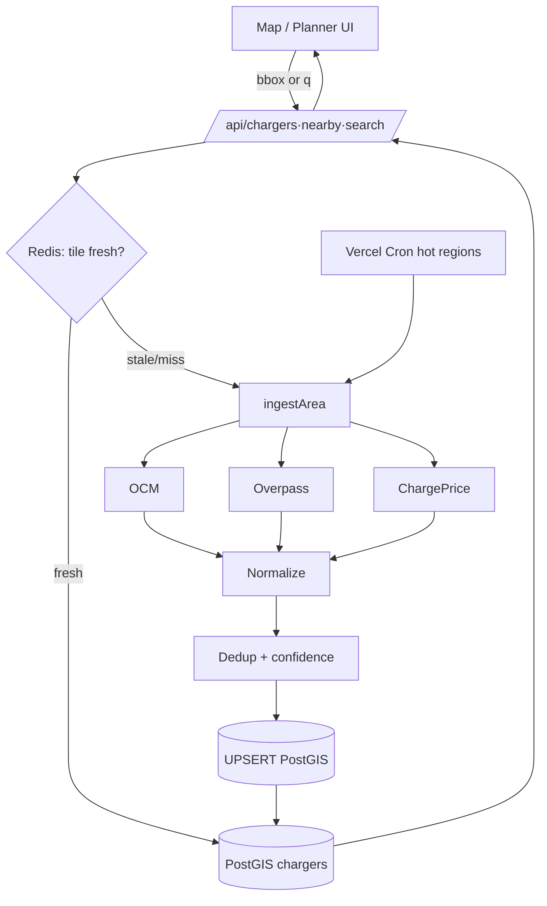

# Charger Data Platform — Design Spec

_Date: 2026-06-03_

## Summary

Replace Flux's slow, per-request live aggregation of charging stations with a
fast, deduplicated, confidence-scored dataset stored in **PostGIS**, fed by a
**hybrid ingestion** pipeline (lazy cache-through + scheduled hot-region
warm-refresh) from **OpenChargeMap + OpenStreetMap/Overpass + ChargePrice**.
Built **natively in the existing Flux stack** (Next.js + Supabase + Upstash
Redis) — no Spring Boot. This is **spec #1** of two; the ABRP-grade route
planner that reads from this data is a later spec.

## Key decisions (approved)

1. **Stack:** native in Flux — Next.js 16 + Supabase Postgres **+ PostGIS** +
   Upstash Redis. No separate Spring Boot service. Reuse existing OCM/Overpass/
   OSRM TypeScript code.
2. **Scope:** charger-data platform first; ingestion scoped to **Europe/Romania**
   initially, architecture global-ready.
3. **Ingestion model:** **hybrid** — lazy cache-through on request + scheduled
   warm-refresh of hot regions (Romania, major EU corridors).
4. **v1 depth:** **core + pricing** (OCM + Overpass discovery, ChargePrice
   pricing enrichment). Availability columns reserved but not ingested.

---

## Section 1 — Architecture & data flow

Components, all under `src/lib/chargers/` (following `src/lib/external/`
conventions):

- **Source connectors** (`ingest/ocm.ts`, `ingest/overpass.ts`,
  `ingest/chargeprice.ts`) — each fetches a bbox and returns a common
  `RawCharger[]`.
- **Normalizer** (`normalize.ts`) — maps each source into the unified schema.
- **Dedup/merge** (`dedup.ts`) + **confidence** (`confidence.ts`).
- **Repository** (`repository.ts`) — PostGIS UPSERTs + the `ingestArea`
  cache-through orchestrator.
- **Query service** (`query.ts`) — nearby / bbox / search over PostGIS, fronted
  by Redis.
- **API routes** — `/api/chargers`, `/api/chargers/nearby`,
  `/api/chargers/search`, `/api/chargers/[id]` (auth + rate-limited).
- **Scheduler** — Vercel Cron → internal warm-refresh route over hot tiles.



**Lazy path:** bbox → check Redis tile freshness → fresh ⇒ serve from PostGIS;
stale/missing ⇒ run `ingestArea(tile)`, UPSERT, set freshness, then serve.
**Scheduled path:** Cron pre-warms Romania + EU corridor tiles via the same
pipeline.

---

## Section 2 — Unified schema & PostGIS tables

**Domain type** (`src/lib/chargers/types.ts`):

```ts
export type ConnectorType =
  | "ccs2" | "ccs1" | "chademo" | "type2" | "type1" | "tesla" | "schuko" | "other";

export type ChargerSourceId = "ocm" | "osm" | "chargeprice";

export interface ChargerConnector {
  type: ConnectorType;
  powerKw: number | null;
  count: number;
}

export interface Charger {
  id: string;
  lat: number;
  lng: number;
  name: string | null;
  operator: string | null;
  operatorId: string | null;            // normalized slug
  address: {
    street: string | null; city: string | null; region: string | null;
    country: string | null; postcode: string | null;
  };
  connectors: ChargerConnector[];
  maxPowerKw: number | null;
  pricing: { perKwh: number; currency: string; source: string } | null;
  availability: "unknown";              // reserved; not ingested in v1
  confidence: number;                   // 0..1
  sources: { source: ChargerSourceId; ref: string }[];
  lastSeenAt: string;
}

// Partially-normalized shape returned by each connector
export interface RawCharger {
  source: ChargerSourceId;
  sourceRef: string;
  lat: number;
  lng: number;
  name: string | null;
  operator: string | null;
  address: Charger["address"];
  connectors: ChargerConnector[];
  pricing: Charger["pricing"];
  raw: unknown;
}
```

**Migration** `supabase/migrations/017_chargers.sql`:

```sql
create extension if not exists postgis;
create extension if not exists pg_trgm;

create table chargers (
  id           uuid primary key default gen_random_uuid(),
  location     geography(Point,4326) not null,
  name         text,
  operator     text,
  operator_id  text,
  country      char(2),
  address      jsonb not null default '{}',
  max_power_kw numeric,
  pricing      jsonb,
  availability text not null default 'unknown',
  confidence   real not null default 0,
  source_count int  not null default 0,
  created_at   timestamptz not null default now(),
  updated_at   timestamptz not null default now(),
  last_seen_at timestamptz not null default now()
);
create index chargers_geo_gix  on chargers using gist (location);
create index chargers_name_tgi on chargers using gin (name gin_trgm_ops);
create index chargers_op_tgi   on chargers using gin (operator gin_trgm_ops);
create index chargers_country  on chargers (country);

create table charger_connectors (
  id uuid primary key default gen_random_uuid(),
  charger_id uuid not null references chargers(id) on delete cascade,
  type text not null, power_kw numeric, count int not null default 1
);
create index cc_charger on charger_connectors (charger_id);

create table charger_sources (
  id uuid primary key default gen_random_uuid(),
  charger_id uuid not null references chargers(id) on delete cascade,
  source text not null, source_ref text not null, raw jsonb not null,
  last_seen_at timestamptz not null default now(),
  unique (source, source_ref)
);

create table ingest_runs (
  id uuid primary key default gen_random_uuid(),
  tile text, source text, status text,
  fetched int, upserted int, error text,
  started_at timestamptz default now(), finished_at timestamptz
);
```

**Notes:** charger tables are **shared reference data, not user data** — no
per-user RLS (`.eq(user_id)` applies only to user data). Reads via Supabase
admin client in authed/rate-limited routes; writes only server-side in ingest.
Nearby queries use `ST_DWithin(location, :point, :m)` + `ST_Distance` sort.

---

## Section 3 — Ingestion, normalization, dedup, confidence

**Connectors** — `fetchTile(bbox): Promise<RawCharger[]>`:
- **OCM** — primary discovery (`/v3/poi` by bbox; richest core fields).
- **Overpass** — secondary discovery (`amenity=charging_station`; coverage gaps).
- **ChargePrice** — **pricing enrichment** keyed by OCM id, not a discovery
  fetch; runs over OCM-sourced chargers.

**Normalization:** canonicalize connector types (OCM connection-type IDs and OSM
`socket:*` tags → enum), W→kW + max, slugify operator with alias map, resolve
country.

**Dedup & merge:**
1. Candidate lookup: exact `(source, source_ref)` → same charger; else PostGIS
   `ST_DWithin(location, raw, 60m)`.
2. Match score (0..1, weighted): spatial proximity + operator similarity +
   connector fingerprint overlap + name/address trigram. ≥ 0.6 ⇒ merge; else new.
3. Merge: union connectors (dedup by type+power), field priority (core: OCM >
   OSM; pricing: ChargePrice only), append provenance, recompute confidence.

**Confidence (0..1):** base from independent-source agreement (1→0.5, 2→0.75,
3→0.9) + completeness bonus (operator, ≥1 powered connector, address) − conflict
penalty (disagreeing power/operator). Stored on `chargers.confidence`; API
filterable via `minConfidence`.

**Orchestrator** `ingestArea(bbox)`: quantize bbox to a stable ~0.1° tile grid →
parallel `fetchTile` (OCM+Overpass via `allSettled`) → normalize → ChargePrice
enrich → load existing canonicals in tile once → dedup/merge → UPSERT → write
`ingest_run` → set Redis tile-freshness key.

---

## Section 4 — Query APIs & contracts

All routes: `auth()` + `session.user.id` check, `checkRateLimit`, Zod-validated
params, served via Supabase admin client. Response items are `Charger` objects.

| Route | Params | Behaviour |
|-------|--------|-----------|
| `GET /api/chargers/nearby` | `lat,lng,radius`(km,≤100), `minKw?`, `connector?`, `minConfidence?`, `limit?`(≤500) | Ensures the covering tile is fresh (lazy ingest), then `ST_DWithin`+distance sort. |
| `GET /api/chargers` | `bbox=minLng,minLat,maxLng,maxLat`, same filters | Viewport query; ensures all covered tiles fresh, returns chargers in bbox. |
| `GET /api/chargers/search` | `q`(≥2), `country?`, `limit?` | Trigram search on name/operator; no geo required; DB-only (no ingest). |
| `GET /api/chargers/[id]` | path id | Single canonical charger with connectors + sources. |

`route-plan` is **out of scope** for this spec (existing `/api/trip-plan`
remains; spec #2 rewires it to read from this platform).

**Filters:** `minKw` → connector power; `connector` → connector type;
`minConfidence` (default 0) → `chargers.confidence >=`.

**Result caching:** short-TTL Redis cache keyed by a hash of the normalized
query (`chargers:q:{hash}`, ~5 min) on top of tile freshness.

---

## Section 5 — Caching, scheduling, deployment, observability, testing

**Caching (Upstash Redis):**
- `chargers:tile:{tile}` → freshness timestamp; lazy TTL 7 days, hot tiles
  refreshed daily.
- `chargers:q:{hash}` → serialized result, ~5 min TTL.
- Background refresh: if a tile is within TTL but older than a soft threshold,
  serve stale + refresh after response (`after()`).

**Scheduling:** `vercel.json` cron → `GET /api/internal/warm?region=ro|eu`,
protected by `x-webhook-secret` header (fail closed 503 if the secret env is
unset, per repo rule). Iterates a predefined hot-tile list, calls `ingestArea`.
Route `maxDuration` raised (≤60s) to fit multi-tile ingest.

**Deployment:** Vercel (app) + Supabase (Postgres+PostGIS). PostGIS + pg_trgm
enabled via migration (verify availability on the Supabase plan first). New env:
`OPEN_CHARGE_MAP_API_KEY` (now recommended for reliable OCM), optional
`CHARGEPRICE_API_KEY`, `INGEST_WEBHOOK_SECRET`; reuse existing Upstash vars.

**Observability:** `ingest_runs` table (per-tile fetched/upserted/status/error),
structured logs from `ingestArea`, Redis counters for ingest success/failure.
Optional `/api/internal/stats` summary.

**Testing (vitest, existing setup):**
- Unit: `normalize` (connector/power/operator mapping), `dedup` (match-score
  fixtures: same/near/different), `confidence` (score table), `tiles`
  (bbox→tile quantization).
- Connector tests use **recorded fixtures** (no live network).
- Repository: integration against a test schema or a mocked Supabase client
  asserting correct UPSERT/merge SQL shape.
- E2E (Playwright): map loads chargers for a bbox; search returns results.

---

## Section 6 — Folder structure & milestones

```
src/lib/chargers/
  types.ts            # unified Charger + RawCharger (shared contract)
  tiles.ts            # bbox ↔ tile-grid helpers, freshness keys
  normalize.ts
  dedup.ts
  confidence.ts
  query.ts            # PostGIS read queries (nearby/bbox/search)
  repository.ts       # UPSERT + ingestArea orchestrator
  ingest/
    ocm.ts
    overpass.ts
    chargeprice.ts
    index.ts          # fetch fan-out used by ingestArea
  __tests__/
src/app/api/chargers/
  route.ts            # GET (bbox)
  nearby/route.ts
  search/route.ts
  [id]/route.ts
src/app/api/internal/warm/route.ts
supabase/migrations/017_chargers.sql
vercel.json           # crons
```

**Milestones:**
- **M0 Foundation:** migration (PostGIS + tables + indexes), `types.ts`,
  `tiles.ts`. Verify PostGIS enabled.
- **M1 Ingestion:** OCM + Overpass connectors + `normalize.ts` + ChargePrice
  enrich, with fixtures + unit tests.
- **M2 Dedup + confidence:** `dedup.ts`, `confidence.ts` + tests.
- **M3 Repository + query:** `ingestArea` orchestrator, PostGIS nearby/bbox/
  search, Redis cache.
- **M4 APIs:** four routes (auth + rate-limit + Zod).
- **M5 Scheduler:** Vercel cron + warm route + webhook secret.
- **M6 Wire UI:** point existing charging-map + the planner's corridor/
  live-station reads at the new platform; preserve current behaviour.
- **M7 Observability + docs:** surface `ingest_runs`, update `docs/FEATURES.md`,
  add a short ingestion runbook.

---

## Out of scope

- ABRP-grade route planner upgrade (separate spec #2, reads from this platform).
- Real-time availability ingestion (columns reserved).
- Commercial sources (PlugShare/ChargeMap/Electromaps) — schema/connector
  interface leaves room; not built now.
- Worldwide bulk import — ingestion is hybrid/regional; global-ready by design.
